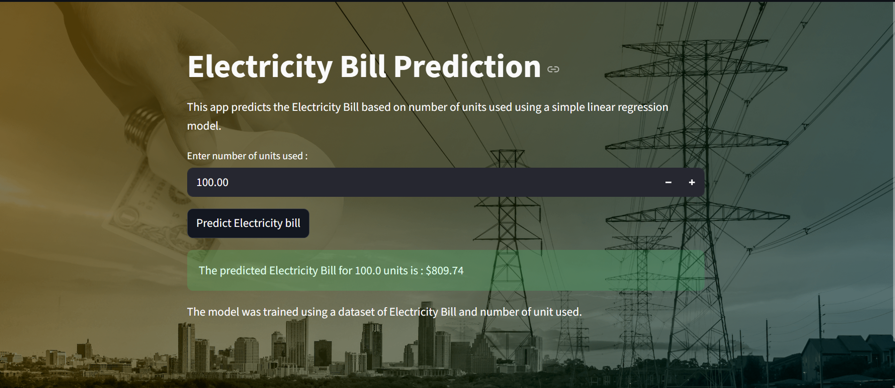

You got it, Aleem — here’s a punchy, honest, and beginner-friendly project description that reflects exactly what’s in your repo, with a little flair:

---

### 🔌 Electricity Bill Prediction — Streamlit + SLR

This project predicts electricity bills based on the number of units consumed using **Simple Linear Regression**. I trained the model on a clean CSV dataset with just two columns: units used and bill amount. The model was built using `scikit-learn`, saved with `pickle`, and deployed in a **Streamlit app** that lets users input their usage and instantly see the predicted bill.

The app features:
- A custom background image (power lines + money 💸)
- Dim overlay for readability
- White text styling for contrast
- A clean input field and prediction button
- Output that shows the predicted bill in ₹

The model achieves an **R² score of 0.9505**, meaning it explains over 95% of the variation in bill amounts — solid performance for a simple linear model. Everything is local: CSV, model, and app. No external APIs, no extra features — just a focused, beginner-friendly regression demo with a polished UI.

